# Forestry Toolkit (ArcGIS Pro Add-in)

An ArcGIS Pro dockpane + ribbon tab covering the common steps of a timber
cruising/forestry workflow: land clearing and road/trail extraction from drone
orthophotos, tree/oil palm detection (ported from the QGIS plugin
`qgis_plugin/tree_counter`, LandTree Analyzer - still under active accuracy
tuning, see the callout below), fishnet grid generation, field-data import
(Excel, geotagged photos, photo-watermark OCR), NASA FIRMS fire hotspot
monitoring, sliver-polygon/biomass/slope/riparian-buffer analysis, a cruising
summary report, GPX export, and a custom photo popup tool.

<!-- Screenshots section - commented out until real screenshots exist (none are
ready yet, 2026-08-18). Uncomment once docs/images/*.png are filled in - see
docs/images/README.md for exact filenames/what each should capture. Leaving this
live with missing files renders as broken links, not a clean placeholder, on both
GitHub and most local Markdown previews.

## Screenshots

<table>
<tr>
<td width="50%"><br/><sub>Panel overview</sub></td>
<td width="50%"><br/><sub>Land Clearing Detection</sub></td>
</tr>
<tr>
<td width="50%"><br/><sub>Road/Trail Extraction</sub></td>
<td width="50%"><br/><sub>Color Reference Sampler</sub></td>
</tr>
</table>

Tree Detection isn't in this lineup on purpose - see the callout on it below and
the [Status](#status-tree-detection--python-backend) section; it's real and
usable but still has open accuracy issues, not a finished result to lead with
yet.
-->

## Architecture

Hybrid: native UI in .NET, detection logic stays in Python (run through
ArcGIS Pro's own bundled Python). Why: the detection pipeline (ExG + Gaussian
matched filter + YOLOv8n ONNX for oil palm) is numpy/scipy-heavy and has been
through a lot of tuning/bugfixing (see `qgis_plugin/AGENTS.md`) - rewriting it
by hand in C# risks reintroducing the same bugs without the ground-truth
harness that already exists there.

```mermaid
flowchart LR
    subgraph ArcGISPro["ArcGIS Pro process (.NET)"]
        Ribbon["Ribbon tab / buttons"]
        DockPane["DockPane WPF UI\n(TreeCounterDockpaneView/ViewModel)"]
        MapTool["Map click tools\n(Photo Popup, Color Sampler)"]
        Ribbon --> DockPane
        MapTool --> DockPane
    end

    subgraph PyBackend["Python subprocess (ArcGIS Pro's own conda env)"]
        Service["PythonBackendService.cs\n(spawns + streams progress)"]
        Scripts["backend/*.py\n(detect.py, detect_clearing.py,\ndetect_roads.py, ...)"]
        Algo["numpy / scipy / scikit-image\nExG + Gaussian filter, YOLOv8/U-Net (ONNX)"]
        Service --> Scripts --> Algo
    end

    subgraph Optional["Optional, opt-in"]
        AI["Gemini / OpenAI / Claude\nAI Vision Validation\n(your own API key)"]
    end

    GP["arcpy GP tools\n(RasterToPolygon, SmoothPolygon, ...)"]
    FC["Feature class in the project gdb"]
    Map["Loaded back onto the active map\nwith symbology"]

    DockPane -- "raster/layer paths + params" --> Service
    Algo -- "mask / points / lines" --> GP
    Algo -. "candidate crops, if enabled" .-> AI
    AI -. "accept/reject" .-> GP
    GP --> FC --> Map
    Service -- "progress % / stage text" --> DockPane
```



```text
src/TreeCounterAddin/     .NET add-in: ribbon button + WPF DockPane (UI)
backend/                  Python port of qgis_plugin/tree_counter, invoked
                          as a subprocess by PythonBackendService.cs
```

- `TreeCounterModule.cs` - module registration.
- `TreeCounterDockpaneViewModel.cs` / `TreeCounterDockpaneView.xaml` - panel:
  pick the active raster layer, profile (Natural Forest / Oil Palm
  Plantation), advanced parameters (sigma, ExG threshold, min smooth), run
  button, status. On success, the result is loaded as a point layer onto the
  active map with simple symbology (red = oil palm, green = forest).
- `PythonBackendService.cs` - shells out to
  `arcgispro-py3\python.exe backend/detect.py`, reads the JSON result summary.
- `backend/raster_io.py` - reads an RGB(+alpha) raster via
  `arcpy.RasterToNumPyArray` plus geotransform info, shared by `detector.py`
  and `yolo_detector.py`.
- `backend/detector.py` - port of `detect_trees`/`compare_detections` from
  `qgis_plugin/tree_counter/detector.py` (ExG + Gaussian matched filter, used
  for the Natural Forest profile, and as the Oil Palm fallback when the YOLO
  model isn't available).
- `backend/yolo_detector.py` - port of `detect_trees_yolo_primary` from
  `qgis_plugin/tree_counter/yolo_detector.py` (local YOLOv8n ONNX as the
  primary detector for Oil Palm Plantation - F1 90.4% vs 72.7% for the older
  hybrid ExG+YOLO path, see `qgis_plugin/AGENTS.md` 2026-07-13; the older
  hybrid path is intentionally not ported since it's superseded).
- `backend/detect.py` - CLI entry point: picks the algorithm per profile,
  writes results to a feature class (`arcpy.da.InsertCursor`) + a JSON summary.
- `backend/sawit_detector.onnx` - YOLOv8n model, copied from
  `qgis_plugin/tree_counter/sawit_detector.onnx`.
- `backend/land_clearing.py` - port of `detect_land_clearing` (same ExG math,
  inverted: low vegetation greenness = bare/cleared ground). Writes a 0/1
  mask *raster* instead of the QGIS original's GDAL/OGR polygon WKT output -
  this add-in doesn't depend on GDAL/OGR (see `raster_io.py`'s own comment),
  so vectorization uses `conversion.RasterToPolygon` instead (in
  `detect_clearing.py`, with `SIMPLIFY` rather than `NO_SIMPLIFY` - the
  latter traces every raster cell's exact edge, which looked like a jagged
  "staircase" rather than a human-digitized boundary). Chunked/blocked like
  `detector.detect_trees`, unlike the QGIS original (which reads the whole
  raster at once) - except the opening/closing smoothing pass (denoise +
  generalize the boundary, also added after a real result looked "too busy"),
  which runs once on the whole assembled mask rather than per-block, since a
  per-block pass can't smooth across a block boundary anyway. Also has an
  unproven `method="obia"` prototype (`build_cleared_mask_obia`, `--method obia`
  on the CLI): segments each block into superpixels with `skimage`'s SLIC first
  and classifies whole segments instead of pixels, aiming for the same smooth-
  boundary result natively instead of via the opening/closing pass - not yet
  validated against a real orthophoto, so `method="exg"` stays the default.
- `backend/detect_clearing.py` - CLI entry point for land clearing detection:
  runs the mask scan, vectorizes it, filters by minimum area, optionally
  erases an "already cleared" exclude area, writes the result + JSON summary.
- `backend/compare_detections.py` - CLI entry point for the Compare Changes
  feature: reads two Tree Detection point feature classes, runs
  `detector.compare_detections()`'s greedy nearest-neighbor match, writes the
  unmatched points back out as "Lost"/"New" point feature classes.

**Not ported** (out of scope for "count trees"): `compute_heterogeneity_raster`
(contrast preview) - a QGIS plugin helper for manually picking where to draw
an exclude mask before running `detect_land_clearing`, separate from the
detection itself and not requested. (`detect_land_clearing` and AI vision
validation *were* both ported, unlike an older note that used to say
otherwise - see `backend/land_clearing.py`, `backend/validator.py`, and the
Analyze/Settings tabs.)

## Features & Usage

Open the panel via the **Forestry Toolkit** ribbon tab -> **Forestry Toolkit**
button (large, left). It has 8 tabs: **Prepare**, **Field Data**, **Analyze**,
**Favorites**, **History** (a running log of what ran, when, and its
result, across every feature), **Settings**, **Help** (a full how-to-use
guide, English/Indonesian), **About**. Every long-running feature shows its progress/result
in a status line under its own section. The raster/polygon/point/line layer
dropdowns refresh themselves automatically on map switch or layer add/remove;
**Refresh** (top of the panel) is still there for the rare case something
doesn't update on its own.

The **English/Indonesian** buttons on the Help tab switch the whole panel, not
just the Help/About text: every static label, tooltip, and every dynamic
status/progress/error message across every feature follows the same
`IsHelpEnglish` flag (`UiStrings.cs`'s `UiTextConverter` for static XAML text,
each ViewModel's own `Tr(en, id)` helper for dynamic messages) - added
2026-08-17 after a single leftover bilingual dropdown made an otherwise
all-English panel look inconsistent.

**Cancel**, where available, stops the operation after its *current* step
finishes (e.g. mid-way through a chain of GP tool calls) - it's cooperative
cancellation, not an instant kill, so there can be a short delay before the
status line shows "Cancelled."

**Favorites tab**: flags layers you use often in a Contents pane that's
otherwise cluttered with one-off results, without touching the layers
themselves. A `"⭐ "` name-prefix approach was considered first and rejected
- a layer's Name also drives its legend text in a printed layout, so
favoriting something would silently change what prints on a map. Favorites
instead live entirely in the add-in (`FavoritesStore.cs`, a local JSON file
keyed by project path so different projects' favorites don't mix): type in
the **Search layer** box to filter the picker down by name (a real map with
enough layers made scrolling the full list to find one tedious - a plain
editable ComboBox's own text search only jumps to the first *prefix* match,
it doesn't narrow the list), pick a layer from the dropdown and click
**★ Add**, then toggle its checkbox to
show/hide it or click **✕** to un-favorite - the actual `Layer.Name`/legend
text is never modified. Its own tab rather than a persistent section above
the tab bar (tried first) - a long favorites list would otherwise push the
tab headers themselves out of view. A plain ArcGIS Pro Group Layer (drag your
common layers into one named e.g. "⭐ Favorites") is a zero-code alternative/
complement worth knowing about too, since it doesn't touch the *layers'*
names either (only the group's).

**History tab**: every feature already writes its own result to a
`XxxStatus` property (`LandClearingStatus`, `RoadExtractionStatus`, ...) -
this tab logs every change to any of them, newest first, into one running
activity trail (`TreeCounterDockpaneViewModel.History.cs`, hooked onto the
`PropertyChanged` event already firing for the ribbon status labels - no
changes needed in any individual feature to show up here, a new feature's
own `FooStatus` property is picked up automatically). Capped at 200
entries; **Clear** empties it. Logs every status change, not just "final"
ones - a multi-stage operation's "Scanning..." / "Vectorizing..." /
"Done: ..." messages all get their own entries, which reads as a
blow-by-blow trail more than noise in practice. No one-click re-run of a
past entry yet (only the status text is captured, not the parameters that
produced it) - add if the log alone isn't enough.

### Prepare tab

- **Flight Mission Planner** - plans the drone survey *before* you fly it (every
  other feature in this add-in analyzes an orthophoto after the fact - this is
  the one exception). Pick a survey area polygon and set altitude, GSD,
  camera image size, front/side overlap, flight line direction, speed, and a
  per-battery flight-time budget, click **Generate Mission**. Produces a
  boustrophedon ("lawnmower") coverage flight plan - a point layer of
  waypoints and a line layer of the flight path, colored by mission part -
  split into battery-sized parts automatically. Pick an **export format**,
  then click **Export Mission...**: **Litchi CSV** (`latitude, longitude,
  altitude(m)`) works with most DJI drones, including the consumer lineup
  (Mavic 3 Classic, Air, Mini) - DJI Fly itself has no waypoint-mission
  import at all, so Litchi is the actual working path there; **DJI Pilot 2
  KMZ** (WPML `template.kml` zipped under `wpmz/`) only works with the
  enterprise lineup (Mavic 3 Enterprise, Matrice 30/300/350) and needs a
  drone model picked from a dropdown, since the file must carry a
  drone-specific code DJI Pilot 2 checks on import. Either way a battery
  split into multiple mission parts becomes one file per part. Zero-waypoint
  failures explain themselves with real numbers (survey area size vs.
  computed line/waypoint spacing) instead of a dead-end message. The
  coverage-geometry math (`FlightMissionMath.cs`) and the KMZ builder
  (`WpmlBuilder.cs`) are pure C# with no ArcGIS reference, unit-tested
  standalone in `src/ForestryToolkit.MathTests` (run with `dotnet run` from
  that folder, no ArcGIS Pro install needed) - same pattern as
  `SliverMath.cs`/`BiomassMath.cs`. Click **Suggest** next to Flight direction
  to auto-fill the bearing that fits the survey polygon's own long axis
  (`FlightMissionMath.SuggestDirection`, a 0-179deg search for the fewest
  coverage lines) - the default 0deg cuts an elongated/irregular site into
  many short, unevenly-lengthed zigzag columns with steep diagonal jumps
  between them (real case: a 2844x804m site needed ~47 lines at 0deg vs. ~13
  at the suggested ~92deg). **Corridor mode** covers a winding, narrow linear
  feature (river/road/pipeline) that no single fixed direction fits well -
  pick a centerline layer and passes follow its own curvature instead
  (`FlightMissionMath.GenerateCorridorPlan`, lanes found adaptively outward
  from the centerline until both sides come up empty, tangent smoothed over
  a window so a sharp bend doesn't cut the corner). **Cross-hatch** flies a
  second pass at +90deg as further mission parts, for better 3D
  reconstruction of vertical features. Altitude/GSD are still independent
  inputs (this doesn't derive one from the other via camera focal length -
  keep them consistent with your drone's actual capture settings yourself). Every
  parameter field has a hover tooltip explaining
  it (`BilingualTooltipConverter.cs`) - reuses the same English/Indonesian
  flag the Help tab exposes rather than adding a second language switch
  just for tooltips, so the language picked there also drives these.
  *Cancel: no (a single in-memory geometry pass, no GP
  tool chain to interrupt).*
- **Fishnet Generator** - pick a planning polygon layer, set cell width/height
  (map units), click **Create Fishnet**. Generates a grid over the polygon's
  extent and clips it to the polygon's actual shape, with a `Cell_ID` field
  for referencing cells in the field. *Cancel: yes.*
- **Export to GPS (GPX)** - pick any point/line/polygon layer, click **Export
  to GPX...** and choose where to save. Polygon layers get their boundary
  turned into a line first (GPX has no "filled area" concept). Opens directly
  in Garmin BaseCamp/Garmin Connect or any GPS device that reads GPX. *Cancel:
  no (each export is a couple of quick GP calls; not worth the added UI).*

### Field Data tab

- **Import Timber Cruising Excel** - click **Download Template...** first if
  you don't have the sheet format yet (ships as
  `Templates/TreeCruisingTemplate.xlsx`); it needs a `TREE DATA` sheet
  (species, diameter, height, volume, X/Y). Pick the matching coordinate
  system (Indonesian UTM zones by name, or "Other" to enter a WKID by hand),
  click **Import Excel...** and choose the file. *Cancel: no (each import is a
  couple of quick GP calls).*
- **Geotagged Field Photos** - click **Import Photos...**, pick JPEGs that
  already have GPS EXIF data (most phone/GPS-camera photos do by default).
  Creates one point per photo with the photo attached, so clicking the point
  in ArcGIS Pro's normal pop-up shows/enlarges it. *Cancel: no (reads EXIF
  tags only, no network/heavy processing).*
- **Photo Coordinate OCR (no EXIF GPS)** - for photos where the coordinates
  are burned into the image itself (e.g. a "GPS Map Camera"-style watermark)
  but EXIF GPS is missing/blank. Pick the watermark format (**UTM Grid** or
  **Latitude/Longitude**) and, for UTM, a default zone/hemisphere used only if
  a photo's own zone letter can't be read. Click **Scan Photos...**, pick the
  JPEGs - this runs fully offline (bundled Tesseract OCR, nothing leaves the
  machine). A review window then shows every photo's detected X/Y so each one
  can be checked/corrected/excluded before anything is created; points are
  only written after clicking **Create Points** in that window. *Cancel: no
  (OCR runs before the review window opens - close the review window without
  clicking Create Points to back out instead).*

### Analyze tab

- **Tree Detection** - ⚠️ **still under active development, not accuracy-
  validated yet.** Runs and produces a result, but real visual checks against
  actual orthophotos (2026-07-31, see the [Status](#status-tree-detection--python-backend)
  section below) found real, still-open problems: one crown sometimes split
  into multiple points, real crowns missed, false positives on blurred/
  stitching-seam regions. Fixing these needs Sigma/threshold recalibration
  against real point-level tree-crown ground truth, which isn't available
  right now (2026-08-17 check - see the Status section). Useful for a rough
  first pass, not yet something to report a tree count from without visually
  checking the result against the orthophoto first. Pick a raster layer and a
  profile (**Natural Forest**
  or **Oil Palm Plantation**; advanced sigma/ExG-threshold/min-smooth
  parameters are on the **Settings** tab), click **Detect Trees**. Runs the
  ported ExG/YOLO pipeline as a background subprocess - safe to switch to a
  different map while it runs. Result loads as a point layer (green =
  forest, red = oil palm). Optionally pick an **exclude area layer** (a
  polygon layer - an already-surveyed block, plantation boundary, or no-go
  zone) to erase any candidate that falls inside it before the result is
  written, same idea and same `PairwiseErase` GP tool as Land Clearing
  Detection's own exclude area layer below (added 2026-08-17 for parity
  between the two). The **"Exclude cleared/bare ground"** checkbox
  (on by default) drops candidates that land on bare soil/roads/open
  ground - added after visual validation against a real orthophoto showed
  false positives there; it roughly doubles run time (a second full raster
  scan), so turn it off if you've already confirmed it's not needed for a
  given site. *Cancel: yes.*
- **Land Clearing Detection** - the opposite of Tree Detection: flags
  bare/cleared ground (low vegetation greenness) instead of tree crowns,
  ported from the same QGIS plugin's `detect_land_clearing`. Pick a raster
  layer, optionally an "exclude area" polygon layer (e.g. area already known
  to be cleared/harvested, so results only show *new* clearings), a minimum
  area in hectares, click **Detect Clearing**. Runs as a background Python
  subprocess (same as Tree Detection), safe against large orthophotos - the
  scan itself is chunked/blocked so memory stays bounded regardless of raster
  size. Ponds/rivers are excluded automatically (they have no vegetation
  greenness either, but read dark/blue rather than bright/reddish like bare
  soil - see `WATER_BRIGHTNESS_MAX` in `backend/land_clearing.py`, added
  2026-08-03 after a real result flagged two ponds as "cleared"). *Cancel:
  yes.*
- **Color Reference Sampler** - collects labeled RGB/ExG field samples to
  calibrate Land Clearing/Road Extraction's own thresholds against real
  imagery instead of eyeballing screenshots. Pick a raster layer and a
  category (Forest canopy, Low vegetation/regrowth, Cleared/bare ground,
  Felled-tree debris, Road/track, Water/river, Shadow, Heavy equipment/
  vehicle, Building/roof, Other/unsure - bilingual, same list as everywhere
  else), click **Start Sampling**, then click points directly on the map;
  each click reads that pixel's R/G/B/ExG through a long-lived
  `backend/pixel_sample_server.py` worker process (stdin/stdout protocol -
  a per-click subprocess would be too slow, and touching
  `ArcGIS.Core.Data.Raster` directly from C# crashed ArcGIS Pro outright, see
  `ColorSamplerMapTool.cs`'s own comment) and adds it to an in-memory list.
  Raster and category are locked for the session once sampling starts - one
  category per session avoids mixing samples that then need re-splitting
  before analysis. Click **Stop Sampling** to write the accumulated points
  out as `ColorReference_<Category>_<timestamp>`, named by category so
  results from different sessions never overwrite each other in the
  Contents pane. *Cancel: n/a (map-click driven, not a GP tool chain).*
- **Road/Trail Extraction** - pulls road/trail centerlines out of the same
  bare-ground signal Land Clearing Detection uses (roads read as "cleared"
  too), skeletonized down to a single line (`skimage.morphology.skeletonize`)
  instead of a filled area, then vectorized with arcpy's own
  `conversion.RasterToPolyline` GP tool - see `backend/road_extraction.py`.
  Not a port of
  [microsoft/RoadDetections](https://github.com/microsoft/RoadDetections)'s
  own approach (its segmentation model is Keras/Python 3.6 trained on
  100cm/px satellite imagery - the wrong resolution regime for our ~5cm/px
  drone orthophotos); its C# geometry-generation module's job (thinning +
  graph construction + graph optimization to turn a mask into a line
  network) is already covered here by skimage + arcpy's own tool, no new
  algorithm needed. Pick a raster layer, a minimum dangle length (drops
  short stub segments skeletonize leaves at noisy mask edges), click
  **Extract Roads**. *Cancel: yes.*

  First real-orthophoto result (2026-08-10): correctly traced a real road
  including a real fork into a connected bare clearing, but fragmented into
  65 separate line segments - most of the extras were short (<10-15m)
  fragments, a normal skeletonize artifact from any mask whose edge isn't
  perfectly smooth, not real forks. A first fix attempt
  (`_prune_skeleton_spurs`, pixel-level: iteratively erode free skeleton
  endpoints before vectorizing) barely helped (65 -> 63) - it turned out
  most of the fragments were short segments bridging two nearby junctions
  (both ends already connected to something else), not free-hanging spurs,
  and a branch pixel diagonally touching two unrelated columns of a long
  straight line is indistinguishable, by simple 8-connected neighbor
  counting, from a real 3-way junction - so short bridges kept surviving
  misclassified as junctions. Replaced (2026-08-11) with
  `_drop_short_bridges` in `road_extraction.py`, operating on the
  *vectorized* output instead: polyline endpoints from `RasterToPolyline`
  are exact float coordinates, no pixel-adjacency ambiguity to get wrong.
  Deletes any line under `--min-dangle-m` (reuses the same knob
  `RasterToPolyline`'s own `minimum_dangle_length` already exposes) whose
  *both* endpoints are shared with another line - the shape
  `minimum_dangle_length` itself can't catch (it only drops dangling stubs
  with one free end).

  Same result, second problem: the line also visibly wandered off the
  actual road surface into the wide bare dirt/quarry/stockpile ground
  alongside it. Root cause - `land_clearing.py`'s mask flags *all* bare
  ground, road or not, and skeletonize follows the medial axis of
  whatever shape it's given; on a wide, irregular blob (a quarry pit, a
  cleared yard) that axis just traces the blob's own shape, not a road.
  `_remove_wide_regions` in `road_extraction.py` filters the mask down to
  its "thin enough to plausibly be a road" parts before skeletonizing, the
  same way real river-centerline extraction excludes lakes from a water
  mask first - **off by default** though (`MAX_ROAD_WIDTH_M = 0`): a first
  attempt at a 12m threshold wiped a real result to 0 features, because on
  that site the bare-ground corridor (road + graded shoulder/embankment)
  runs wider than 24m for long stretches, not just at isolated quarry
  pockets like assumed - one blanket constant can't tell "wide road" from
  "wide quarry" without more site-specific tuning than a guess can give
  it. Same status as `land_clearing.py`'s `fresh_color` flag: a knob to
  try per-site (**Max road width** on the Road/Trail Extraction section,
  wired to `detect_roads.py`'s `--max-width-m` CLI flag 2026-08-17 - was
  CLI-only before that), not a default fix - a wandering-but-present line
  beats producing nothing.

  First quantitative accuracy check (2026-08-11), same "buffer method"
  road-network metric the `microsoft/RoadDetections` README itself reports
  pixel precision/recall with (Wiedemann et al. 1998 - completeness =
  ground-truth length within a buffer of the extraction / total
  ground-truth length; correctness = extraction length within a buffer of
  the ground truth / total extraction length), against a real
  human-digitized road shapefile (`hasil digit/digitasi jalan.shp`, ~6.2km/
  11 segments) over its actual source orthophoto
  (`260726_Bypass AKT_1m.tif`, 1m/px - the same tile class
  `land_clearing.py`'s own `OPENING_ITERATIONS` sweep used): at a 10m
  buffer, the then-current defaults scored correctness 49.8%/completeness
  57.9% (F1 53.5%). Confirmed `MAX_ROAD_WIDTH_M`'s off-by-default status
  quantitatively (every value from 15-50m scored *worse* than 0, F1
  dropping to 0-18%). Sweeping `exg_threshold` instead (the mask's own
  vegetation-greenness cutoff) found a real, unrelated improvement: 8
  peaked at F1 60.3% (correctness 58.3%/completeness 62.4%) vs. 53.5% at
  the old default (18, shared with `land_clearing.py` at the time) - now
  `road_extraction.DEFAULT_ROAD_EXG_THRESHOLD`, deliberately *not* shared
  with `land_clearing.py`'s own `DEFAULT_EXG_THRESHOLD` anymore, since a
  centerline (skeletonize is sensitive to the full mask width) benefits
  from a stricter/narrower mask more than `land_clearing.py`'s own area-
  overlap accuracy target does. `min_dangle_m` was swept too (3-15m) and
  made no measurable difference (F1 flat at 60.3%) - left at its existing
  5m default. Sweep scripts left as reference logic, not checked in - same
  precedent as `land_clearing.py`'s own tuning script.

  A learned (not just ExG-threshold) road mask was the obvious next lever to
  try - `backend/training/road_segmentation_massachusetts.ipynb` (Kaggle,
  free GPU) trains a small U-Net for exactly this on a resolution-matched
  public dataset, exporting to ONNX (`backend/road_unet.py` +
  `backend/road_unet.onnx`, wired in as `mask_source="unet"` /
  `--mask-source unet`, same "optional model, lazy import" pattern as
  `yolo_detector.py`'s oil-palm model). Trained (2026-08-12) and measured
  against the same real ground truth: at a 10m buffer, correctness jumped to
  80.2% (vs. ExG's 49.8% - when it says "road" it's usually right) but
  completeness dropped to 23.5% (vs. ExG's 57.9% - it misses most of the
  road), net F1 36.3% - **worse** than the ExG baseline's 53.5%, so it stays
  opt-in rather than becoming the default. Makes sense: this base model has
  only ever seen Massachusetts roads, nothing resembling an Indonesian
  logging/mining haul road, and is conservative about what it's willing to
  call "road" as a result. The high correctness is the encouraging part -
  fine-tuning it on real local ground truth (the notebook's own "Next
  steps" section) is the natural next step before writing this approach
  off, not confirmation it can't work. Blocked for now (2026-08-17 check):
  fine-tuning needs a Kaggle GPU session (can't run from this add-in's own
  dev environment) plus meaningfully more local road ground truth than the
  one 6.2km/11-segment shapefile above - thin for fine-tuning a
  segmentation net even with transfer learning. Whoever picks this up next
  runs the notebook themselves per its own "Next steps" section.
- **Compare Changes** - change detection between two Tree Detection runs of
  the same site over time. Pick the old and new detection point layers and a
  match distance (meters - covers re-run centroid jitter, not just exact
  pixel repeats), click **Compare**. Wraps `detector.compare_detections()`'s
  greedy nearest-neighbor matching (already ported, just needed a UI - see
  `backend/compare_detections.py`); old points with no match load as a red
  "Lost" layer (likely felled), new points with no match load as a green
  "New" layer (likely regrowth/previously missed). *Cancel: no (a single
  quick nearest-neighbor match, no GP tool chain).*
- **NASA FIRMS Fire Hotspots** - loads satellite-detected active-fire points
  over the current map extent (no polygon needed - just zoom/pan to the area,
  click **Load Fire Hotspots**), for cross-checking Land Clearing Detection
  results since burning is a common land-clearing method, and general
  karhutla monitoring. Needs a free MAP_KEY from
  [firms.modaps.eosdis.nasa.gov](https://firms.modaps.eosdis.nasa.gov),
  entered once on the **Settings** tab (stored DPAPI-encrypted via
  `ApiKeyStore`, same mechanism as the AI Vision Validation keys, under its
  own `"firms"` entry). **All Sources** (default) queries 4 data sources at
  once, spanning 5 satellites - VIIRS on Suomi NPP/NOAA-20/NOAA-21 (one
  satellite each) + `MODIS_NRT` (a single source that itself combines Terra
  and Aqua) - and merges the results; a real side-by-side test found a
  genuine hotspot that only MODIS caught, all 3 VIIRS satellites missed it
  that day, so folding MODIS into the default merge (not just VIIRS)
  measurably matters. The 4 requests run
  in parallel (`Task.WhenAll`), not one after another - noticeably faster
  than awaiting them in a loop, especially with all 4 sources selected. One
  source erroring doesn't sink the whole query, only that source is skipped
  (noted in the final status) - it only fails outright if every source
  errors. Shown as a **Heat Map** (density blob, not individual dots) -
  `CIMHeatMapRenderer`'s `ColorScheme` needed an explicit red/orange/yellow
  `CIMMultipartColorRamp`; leaving it unset renders grayscale, not the
  "hot" look you'd expect. Zero-result runs show the actual lat/lon box
  that was searched in the status line, so "genuinely no fires this
  window" and "the extent used wasn't where you meant" (e.g. zoomed out
  too far on a UTM-projected map, breaking the extent-to-lat/lon
  conversion - also caught explicitly, with its own error message) aren't
  indistinguishable. *Cancel: yes.*

  A wind-direction/smoke-drift overlay (arrows or dashes showing which way
  smoke would blow from a hotspot) was tried and removed - four different
  renderings (a rotated point symbol, a decorative bow on a line, a real
  RK4-traced streamline field, a dense Windy.com-style dash field) each hit
  their own rotation/scale problems without landing on something that
  actually looked right, and the effort-to-payoff ratio stopped making
  sense. `Open-Meteo`'s free current-weather API (no key needed) is still
  the natural source if this gets revisited - either build the field
  properly (bilinear-interpolated wind grid + RK4 streamline tracing is the
  standard technique real tools like Windy.com use) or skip it and just
  point users at Windy.com/BMKG directly for wind context.
- **Sliver Polygon Detection** - pick a polygon layer, click **Detect
  Slivers**. Auto-calibrates against that layer's own median part size/shape
  (no fixed threshold to tune) and selects the flagged slivers on the map.
  *Cancel: no (a single in-memory scan, no GP tool calls to chain).*
- **Biomass & Carbon Estimation** - pick a point layer that has a `Volume`
  field (from an Excel import), click **Estimate**. Uses the wood
  density/BEF/root-shoot-ratio/carbon-fraction constants on the **Settings**
  tab (generic tropical-forest defaults - edit them for your species mix/
  region) and adds per-tree `Biomass_kg`/`Carbon_kg` fields. *Cancel: no (a
  couple of quick GP calls).*
- **Slope from DEM** - pick a single-band elevation raster, click **Compute
  Slope**. Requires a licensed Spatial Analyst extension. Output is
  classified into forestry accessibility bands (green <=15% easy, yellow
  15-25% moderate, orange 25-40% difficult, red >40% restricted) instead of a
  plain grayscale stretch. *Cancel: yes.*
- **Riparian Buffer Check** - pick a river/stream layer and a planning
  polygon layer, set the buffer distance (meters - no fixed legal number is
  assumed, since this varies by regulation/river class), click **Check
  Buffer**. Buffers the river and intersects it with the plan; if nothing
  overlaps, no extra layer is added. *Cancel: yes.*
- **Cruising Summary Report** - pick a point layer with both `Volume` and
  `Species` fields, click **Generate Report...** and choose where to save.
  Produces a species x volume summary spreadsheet (sum + count per species).
  *Cancel: yes.*

### Settings tab

- **Advanced Detection Parameters** - sigma / ExG threshold / min-smooth for
  Tree Detection; auto-filled per profile, editable per run.
- **AI Vision Validation** - optional Gemini/OpenAI/Claude API key + model, to
  validate Tree Detection results. Keys are saved encrypted (DPAPI) per
  provider, so switching providers doesn't lose the other's key. **Test
  Key** checks it works before running a full detection.
- **NASA FIRMS MAP_KEY** - free token for the Fire Hotspots feature above,
  same DPAPI-encrypted storage as the AI Vision Validation keys. **Test
  Key** hits FIRMS' own `mapkey_status` endpoint and reports valid/invalid
  plus the current 10-minute transaction usage (5000/10min limit).
- Fishnet cell size, cruising coordinate system, and biomass constants are
  saved automatically as they're changed (plain JSON, no dialog needed) and
  restored next time ArcGIS Pro opens.

### Photo Popup (ribbon tool, not in the panel)

A custom map tool for viewing a point's attached photo inline, since ArcGIS
Pro's native pop-up only shows a hierarchical field list, not the photo
itself. Click **Photo Popup** in the ribbon's **Analysis** group (next to
**Detect Trees**), then click a point that has a photo attachment (from
Geotagged Field Photos or Photo Coordinate OCR) - a floating card with the
photo appears, anchored to that point (it follows if you pan/zoom, and
disappears if the point scrolls out of view). Left-click is reserved for this
while the tool is active, so:

- Pan with **right-click-drag**, zoom with the **scroll wheel** (both work
  normally).
- To go back to normal left-click-drag panning/selection, press **Esc** or
  switch to the **Explore** tool (Map tab -> Navigate group) - ribbon tool
  buttons aren't on/off toggles, they're "which tool is active right now."

## Build & Deploy

Requires **.NET 10 SDK** (`winget install Microsoft.DotNet.SDK.10`) - the
ArcGIS Pro 3.7 SDK (`Esri.ArcGISPro.Extensions30`) targets
`net10.0-windows7.0`.

**If you have the full Visual Studio IDE** (not just Build Tools) with the
.NET desktop workload: open `TreeCounterPro.sln`, hit Build. Esri's
`PackageArcGISContents` target automatically packages the `.esriAddinX` and
registers it with ArcGIS Pro via `RegisterAddIn.exe`.

**If you only have the `dotnet` CLI / VS Build Tools** (like this
environment): Esri's packaging target uses an inline `CodeTaskFactory` task,
which the .NET Core flavor of MSBuild doesn't support (`dotnet build` fails
at that step even though the C#/XAML compilation itself succeeds). Use the
`deploy.ps1` script instead - it builds via `dotnet build` then replicates
Esri's packaging step by hand (zips into a `.esriAddinX` + calls
`RegisterAddIn.exe`):

```powershell
.\deploy.ps1
```

This pops the **"Esri ArcGIS Add-In Installation Utility"** dialog (the add-in isn't
digitally signed) - click **Install Add-In**. This step is not optional: skipping it
(or using `RegisterAddIn.exe /s`) leaves the file sitting in the AddIns folder but
ArcGIS Pro never actually loads the DLL - no error anywhere, the ribbon tab/button
still render (pure DAML), but nothing they do has any effect. Confirmed by checking
`Get-Process ArcGISPro | Select Modules` - the DLL was entirely absent from the
process until this dialog was clicked once.

Then restart ArcGIS Pro and check the **Forestry Toolkit** ribbon tab.

Also note: every attribute the schema marks `required` actually has to be there -
`Config.daml`'s `tab`/`group`/`button` elements all require a `keytip` attribute,
which isn't obvious from most samples using short values like `T1`/`G1`/`B1` and is
easy to miss by hand. Validate against the real schema before chasing runtime ghosts:

```powershell
$xsdPath = "C:\Program Files\ArcGIS\Pro\bin\ArcGIS.Desktop.Framework.xsd"
$schemas = New-Object System.Xml.Schema.XmlSchemaSet
$schemas.Add("http://schemas.esri.com/DADF/Registry", $xsdPath) | Out-Null
$settings = New-Object System.Xml.XmlReaderSettings
$settings.ValidationType = [System.Xml.ValidationType]::Schema
$settings.Schemas = $schemas
$settings.add_ValidationEventHandler({ param($s,$e) Write-Host "$($e.Severity): $($e.Message)" })
$reader = [System.Xml.XmlReader]::Create("src\TreeCounterAddin\Config.daml", $settings)
try { while ($reader.Read()) {} } finally { $reader.Close() }
```

## Python backend

Runs under Pro's bundled conda env (`arcgispro-py3`) so `arcpy` is available.
For the Oil Palm Plantation profile (YOLO), install `onnxruntime` + `pillow`
into that same env (already installed in this environment):

```powershell
& "C:\Program Files\ArcGIS\Pro\bin\Python\envs\arcgispro-py3\python.exe" -m pip install onnxruntime pillow
```

Tests (run with Pro's bundled python, all already passing in this
environment):

```powershell
& "C:\Program Files\ArcGIS\Pro\bin\Python\envs\arcgispro-py3\python.exe" backend\test_detect.py             # CLI smoke test (argparse, exit codes)
& "C:\Program Files\ArcGIS\Pro\bin\Python\envs\arcgispro-py3\python.exe" backend\test_pipeline_e2e.py        # e2e: synthetic raster -> detect_trees -> detected positions
& "C:\Program Files\ArcGIS\Pro\bin\Python\envs\arcgispro-py3\python.exe" backend\test_land_clearing_e2e.py   # e2e: synthetic raster -> detect_land_clearing -> mask matches planted patch
& "C:\Program Files\ArcGIS\Pro\bin\Python\envs\arcgispro-py3\python.exe" backend\test_compare_detections_e2e.py  # e2e: feature classes -> compare_detections -> lost/new feature classes
```

## Status (Tree Detection / Python backend)

Done: algorithm port (ExG for forest + YOLO for oil palm), feature class
output + auto-load onto the map with symbology, advanced parameter controls
in the DockPane.

**Not done:**

- Backend pipeline confirmed working against a real large drone orthophoto
  (54150x36052 px, 4-band, ~6.3 GB, "Natural Forest" profile) via direct CLI
  run of `detect.py` - completed without error/memory issues, 7,369 trees
  over ~660 ha. `detect_clearing.py` confirmed working against the same
  orthophoto too - 389 cleared/bare-ground polygons, ~30.7 ha total.
- Visual validation against that same real orthophoto (2026-07-31, from the
  ArcGIS Pro UI) found real accuracy issues, not just "does it run without
  crashing": (1) false-positive points on bare/cleared ground - partially
  addressed by the "Exclude cleared/bare ground" option + a stricter
  `min_density` (see `detector.py`/`detect.py`; reduced 7,369 -> 7,294
  points, 36 explicitly filtered as on cleared ground vs. only 3 before the
  threshold fix), (2) one real tree crown sometimes split into multiple
  points (Sigma likely too small for that crown's actual size), (3) many
  real crowns missed entirely, (4) false positives on visibly
  blurred/stitching-artifact regions of the orthomosaic. (2)-(3) are still
  open - would need a round of Sigma/threshold recalibration against real
  ground truth (the way `land_clearing.py`'s morphology constants got
  tuned). (4) has a candidate fix now: `detect_trees`'/`detect.py`'s
  `exclude_blurry` option (2026-08-03, opt-in, off by default) drops
  candidates in low local-detail regions ("variance of Laplacian", the
  classic blur-detection metric - see `BLUR_VARIANCE_MIN` in
  `detector.py`) computed straight off each block's own pixels, no extra
  raster pass needed. Same status as `land_clearing.py`'s `fresh_color`
  flag: the threshold was picked by eye against a synthetic blur/texture
  test, not swept against a real blurred orthophoto region - try it
  site-by-site (`--exclude-blurry` on `detect.py`) rather than trusting it
  as a universal default.
- (2)/(3)'s Sigma/threshold recalibration and (4)'s `exclude_blurry` sweep
  both stay blocked, not just "still open" (2026-08-17 check): both need
  imagery at the same 5cm/px resolution regime as the real drone orthophoto
  above (`REFERENCE_GSD_M` in `detector.py`) - individual crowns aren't
  resolvable at the 1m/px tiles `land_clearing.py`/`road_extraction.py`'s own
  ground-truth tuning uses (see their own README entries), and that 1m/px
  regime is all that's currently reachable on disk. The original
  54150x36052px drone orthophoto itself couldn't be relocated either. Needs:
  that orthophoto (or an equivalent 5cm/px tile) back in reach, plus
  point-level tree-crown ground truth for (2)/(3) specifically - nothing to
  recalibrate against otherwise.
- Land Clearing Detection's boundary also looked "too busy/jagged, not like
  human digitization" on first visual check - fixed with an opening+closing
  smoothing pass on the mask plus switching `RasterToPolygon` to `SIMPLIFY`
  (see `land_clearing.py`/`detect_clearing.py`); polygon count on the same
  real orthophoto dropped from 389 to 317 (small noise fragments removed)
  while total area stayed essentially the same (~30.7 -> ~30.9 ha).
- First quantitative accuracy check (2026-08-02) against a real
  human-digitized ground-truth shapefile (a 1 m/px orthophoto tile + its
  matching "Land Aktif...Disturb" polygons from `D:\Data Bukaan\Digitasi
  Juli 2026`): the opening pass above (10 iterations) was trading recall for
  precision more than intended - 73.1% recall / 92.4% precision (F1 81.6%)
  vs. 80.0%/77.2% (F1 78.6%) with opening removed entirely. A sweep over
  opening=0..10 found opening=6 Pareto-dominates the original 10 on this
  ground truth (76.2% recall / 88.4% precision, F1 81.9% - both metrics
  better, not a trade-off), now the default in `land_clearing.py`. The
  QGIS original's `fresh_color` road/river color filter was also ported as
  an opt-in `--fresh-color`/`--bright-min` CLI flag, but measured worse on
  this tile (67.9% recall) so stays off by default - a knob for site-by-site
  tuning against that site's own ground truth, not a universal fix.
- Real orthophoto also showed ponds inside the survey area flagged as
  "cleared" (2026-08-03 - two water bodies near a road/bare-soil patch,
  visually confirmed) - water has no vegetation greenness either (same low
  ExG as bare soil) but reads dark/blue rather than bright/reddish, so it's
  now excluded unconditionally (`WATER_BRIGHTNESS_MAX` in
  `land_clearing.py`) rather than gated behind the `fresh_color` flag above.
  Picked by eye against the reported false positive, not swept against
  ground truth like `OPENING_ITERATIONS` was - revisit if it starts clipping
  real dark/wet bare soil on some site.
- "Compare Changes" (diff two Tree Detection runs over time) now has a
  DockPane UI (Analyze tab) - `detector.compare_detections()`'s
  nearest-neighbor matching was already ported, just needed
  `backend/compare_detections.py` (CLI) + `PythonBackendService`/DockPane
  wiring (2026-08-03).
- The Color Reference Sampler tool above accumulated 721 real labeled
  samples (2026-08-17), enabling two real-data recalibrations neither
  threshold had gotten before: `DEFAULT_EXG_THRESHOLD` 18 -> 26 (recall
  against confirmed bare-ground samples 48.2% -> 92.7%, precision also
  improved, not a trade-off) and `WATER_BRIGHTNESS_MAX` 90 -> 150 (the old
  value caught 0 of 61 real water samples that actually needed rescuing
  from the low-ExG "cleared" mask - real water at this site reads
  turbid/silty, not the dark clean water 90 assumed; 150 catches 70% of
  them with zero bare-soil samples wrongly excluded). Re-tested
  `fresh_color` at the new ExG=26 threshold against the independent
  Lampunut ground truth the same day: still net negative (F1 73.5% ->
  57.5%, recall dropped ~19 points cutting real pale/dry bare soil, not
  just roads/rivers) - stays off by default, consistent with the original
  finding above.

## License

[MIT](LICENSE) - the add-in code (C#/.NET UI, `PythonBackendService`, etc.) is original
to this repo. The detection algorithms in `backend/` are ported from the QGIS plugin
LandTree Analyzer (see `backend/*.py` module docstrings for which functions came from
where) - verify that plugin's own license terms before redistributing this project if
that matters for your use case, since porting doesn't change what license the original
logic itself was under.
