# Forestry Toolkit (ArcGIS Pro Add-in)

<div align="center">

[](https://github.com/Ahmedseko/forestry-toolkit/stargazers)
[](LICENSE)
[](https://github.com/Ahmedseko/forestry-toolkit/commits/main)
[](https://github.com/Ahmedseko/forestry-toolkit/releases/latest)
[](.)

[](#build--deploy)
[](https://github.com/Ahmedseko/forestry-toolkit/releases/latest)

[Releases](https://github.com/Ahmedseko/forestry-toolkit/releases) · [Devlog](docs/DEVLOG.md) · [Report an Issue](https://github.com/Ahmedseko/forestry-toolkit/issues)

</div>

An ArcGIS Pro dockpane and ribbon tab for timber cruising / forestry work:
land clearing and road/trail extraction from drone orthophotos, tree and oil
palm detection, fishnet grids, field-data import (Excel, geotagged photos,
photo OCR), NASA FIRMS fire hotspots, sliver/biomass/slope/riparian
analysis, a cruising summary report, GPX export, and a photo popup tool.

Tree/oil palm detection is a port of the QGIS plugin
`qgis_plugin/tree_counter` (LandTree Analyzer). It's still being tuned for
accuracy — see [Known limitations](#known-limitations) before trusting a
count from it.

## Demos

Screen captures from ArcGIS Pro, hosted as [release assets](https://github.com/Ahmedseko/forestry-toolkit/releases/tag/demo-videos) (compressed from the originals) since git history is the wrong place for video files.

<table>
<tr>
<td width="50%">

**Flight Mission Planner** — survey polygon in, coverage flight lines + battery split out.

<video src="https://github.com/Ahmedseko/forestry-toolkit/releases/download/demo-videos/flight-mission-planner.mp4" controls width="100%"></video>

</td>
<td width="50%">

**NASA FIRMS Fire Hotspots** — loading satellite-detected fire hotspots over the current map extent.

<video src="https://github.com/Ahmedseko/forestry-toolkit/releases/download/demo-videos/nasa-firms.mp4" controls width="100%"></video>

</td>
</tr>
</table>

<!-- Screenshots: commented out until docs/images/*.png are filled in
(none ready yet, 2026-08-18). See docs/images/README.md for filenames. -->

## Features

Open the **Forestry Toolkit** ribbon tab, then the **Forestry Toolkit**
button. The panel has 8 tabs.

### Prepare

- **Flight Mission Planner** — plans a drone survey before you fly it. Set
  altitude, GSD, camera size, overlap, flight direction, speed, and a
  per-battery time budget; generates a lawnmower coverage plan (waypoints +
  flight lines), split into battery-sized parts. Export as **Litchi CSV**
  (most DJI consumer drones — DJI Fly has no waypoint import) or **DJI Pilot
  2 KMZ** (enterprise models only). **Suggest** picks the flight direction
  that needs the fewest coverage lines. **Corridor mode** follows a winding
  river/road/pipeline instead of one fixed direction. **Cross-hatch** adds a
  perpendicular second pass for better 3D reconstruction.
- **Fishnet Generator** — grid over a polygon's extent, clipped to its
  shape, with a `Cell_ID` field per cell.
- **Export to GPX** — any point/line/polygon layer to GPX, for Garmin
  BaseCamp/Connect or any GPX-reading GPS device.

### Field Data

- **Import Timber Cruising Excel** — imports a `TREE DATA` sheet (species,
  diameter, height, volume, X/Y). Template downloadable from the panel; pick
  an Indonesian UTM zone or enter a WKID.
- **Geotagged Field Photos** — turns geotagged JPEGs into a point layer,
  one point per photo, with the photo attached.
- **Photo Coordinate OCR** — for photos with coordinates burned into the
  image (a "GPS Map Camera"-style watermark) instead of EXIF GPS. Runs
  offline (bundled Tesseract). Shows a review window to check/correct each
  detected coordinate before creating any points.

### Analyze

- **Tree Detection** — Natural Forest (ExG + Gaussian matched filter) or Oil
  Palm Plantation (YOLOv8n ONNX) profile. Runs as a background subprocess,
  loads a point layer (green = forest, red = oil palm). Not yet
  accuracy-validated — see [Known limitations](#known-limitations).
- **Land Clearing Detection** — flags bare/cleared ground using the same
  vegetation signal as Tree Detection, inverted. Ponds/rivers are excluded
  automatically. Chunked, so it handles large orthophotos.
- **Color Reference Sampler** — click points on the map to build a labeled
  RGB/ExG dataset, used to calibrate the Land Clearing / Road Extraction
  thresholds against real imagery instead of eyeballing screenshots.
- **Road/Trail Extraction** — skeletonizes the bare-ground mask into
  road/trail centerlines. See [docs/DEVLOG.md](docs/DEVLOG.md) for the
  accuracy-tuning history.
- **Compare Changes** — diffs two Tree Detection runs of the same site over
  time into "Lost" (likely felled) and "New" (likely regrowth) point layers.
- **NASA FIRMS Fire Hotspots** — active-fire points over the current map
  extent, from VIIRS (3 satellites) + MODIS, shown as a heat map. Needs a
  free `MAP_KEY` from
  [firms.modaps.eosdis.nasa.gov](https://firms.modaps.eosdis.nasa.gov),
  entered once on the Settings tab.
- **Sliver Polygon Detection** — auto-calibrates against the layer's own
  median part size and selects the flagged slivers on the map.
- **Biomass & Carbon Estimation** — adds `Biomass_kg`/`Carbon_kg` fields
  from a `Volume` field, using editable wood-density/BEF/carbon constants.
- **Slope from DEM** — classified into forestry accessibility bands (easy /
  moderate / difficult / restricted) instead of a plain grayscale stretch.
  Needs a licensed Spatial Analyst extension.
- **Riparian Buffer Check** — buffers a river layer and intersects it with
  a planning polygon at whatever buffer distance you set.
- **Cruising Summary Report** — species x volume summary spreadsheet from a
  point layer with `Volume` and `Species` fields.

Most long-running features can be cancelled mid-run (cooperative — it
finishes the current step first). The exceptions are single quick GP calls
where a Cancel button wouldn't do anything useful.

### Other tabs

- **Favorites** — star layers you use often without touching their name or
  legend text (a separate JSON store, keyed per project).
- **History** — a running log of every result across every feature, newest
  first, capped at 200 entries.
- **Settings** — advanced detection parameters, AI vision validation keys
  (Gemini/OpenAI/Claude, DPAPI-encrypted, optional — used to double-check
  Tree Detection results), FIRMS API key, fishnet/cruising/biomass defaults.
- **Help** / **About** — full how-to-use guide. The whole panel, not just
  this tab, switches between English and Indonesian from here.

### Photo Popup (ribbon tool)

A map click tool for viewing a point's attached photo inline — ArcGIS Pro's
native popup only lists fields, not the photo. Click **Photo Popup** in the
ribbon, then click a point that has a photo attachment. Press **Esc** or
switch to the Explore tool to get normal left-click panning back.

## Architecture

Native .NET UI, detection logic in Python (run through ArcGIS Pro's own
bundled Python). The detection pipeline is numpy/scipy-heavy and has been
through a lot of tuning against the QGIS plugin it's ported from — rewriting
it in C# would risk reintroducing bugs that pipeline already fixed.

```mermaid
flowchart LR
    subgraph Pro["ArcGIS Pro process (.NET)"]
        Ribbon["Ribbon tab / buttons"]
        DockPane["DockPane WPF UI"]
        MapTool["Map click tools"]
        Ribbon --> DockPane
        MapTool --> DockPane
    end

    subgraph Py["Python subprocess (Pro's own conda env)"]
        Service["PythonBackendService.cs"]
        Scripts["backend/*.py"]
        Algo["numpy / scipy / scikit-image<br/>ExG + Gaussian filter, YOLOv8/U-Net (ONNX)"]
        Service --> Scripts --> Algo
    end

    AI["Optional AI vision check<br/>(Gemini / OpenAI / Claude, your own key)"]
    GP["arcpy GP tools"]
    FC[("Feature class in the project gdb")]
    Map["Loaded back onto the map, symbolized"]

    DockPane -- "raster/layer paths + params" --> Service
    Algo -- "mask / points / lines" --> GP
    Algo -. "candidate crops, if enabled" .-> AI
    AI -. "accept/reject" .-> GP
    GP --> FC --> Map
    Service -- "progress / stage text" --> DockPane

    classDef arcgis fill:#dbeafe,stroke:#2563eb,color:#1e293b
    classDef python fill:#dcfce7,stroke:#16a34a,color:#1e293b
    classDef optional fill:#fef3c7,stroke:#d97706,color:#1e293b,stroke-dasharray: 4 3
    classDef data fill:#ede9fe,stroke:#7c3aed,color:#1e293b

    class Ribbon,DockPane,MapTool arcgis
    class Service,Scripts,Algo python
    class AI optional
    class GP,FC,Map data
```



```text
├── src/TreeCounterAddin/   .NET add-in - ribbon button + WPF DockPane (UI)
└── backend/                Python port of qgis_plugin/tree_counter, invoked
                             as a subprocess by PythonBackendService.cs
```

Key files:

- `TreeCounterModule.cs` — module registration.
- `TreeCounterDockpaneViewModel.cs` / `TreeCounterDockpaneView.xaml` — the
  panel itself.
- `PythonBackendService.cs` — shells out to
  `arcgispro-py3\python.exe backend/detect.py`, reads back a JSON summary.
- `backend/raster_io.py` — reads an RGB(+alpha) raster via
  `arcpy.RasterToNumPyArray`, shared by `detector.py` and `yolo_detector.py`.
- `backend/detector.py` — ExG + Gaussian matched filter (Natural Forest
  profile, and the Oil Palm fallback when the YOLO model isn't available).
- `backend/yolo_detector.py` — local YOLOv8n ONNX, the primary Oil Palm
  detector (F1 90.4% vs. 72.7% for the older hybrid path — see
  [docs/DEVLOG.md](docs/DEVLOG.md)).
- `backend/detect.py` — CLI entry point: runs the right algorithm per
  profile, writes a feature class + JSON summary.
- `backend/land_clearing.py` — inverse of tree detection: low vegetation
  greenness = bare/cleared ground. Writes a raster mask instead of the QGIS
  original's GDAL/OGR polygon output, so this add-in has no GDAL/OGR
  dependency.
- `backend/detect_clearing.py` — CLI entry point for land clearing: scans,
  vectorizes, filters by minimum area, writes the result.
- `backend/compare_detections.py` — CLI entry point for Compare Changes.

## Build & deploy

Requires **.NET 10 SDK** (`winget install Microsoft.DotNet.SDK.10`).

**With the full Visual Studio IDE**: open `TreeCounterPro.sln`, hit Build.
Esri's `PackageArcGISContents` target packages the `.esriAddinX` and
registers it automatically.

**With just the `dotnet` CLI / VS Build Tools**: Esri's packaging target
needs an inline `CodeTaskFactory` task that .NET Core MSBuild doesn't
support, so `dotnet build` alone can't package it. Use `deploy.ps1` instead
— it builds via `dotnet build`, then zips into a `.esriAddinX` and calls
`RegisterAddIn.exe` by hand:

```powershell
.\deploy.ps1
```

This pops the **"Esri ArcGIS Add-In Installation Utility"** dialog (the
add-in isn't signed) — click **Install Add-In**. Not optional: skip it and
ArcGIS Pro never loads the DLL, even though the ribbon tab still renders
fine and looks like nothing's wrong. Restart ArcGIS Pro afterward and check
the **Forestry Toolkit** ribbon tab.

If the ribbon renders but nothing you click does anything, see
[CLAUDE.md](CLAUDE.md) for the `.esriAddinX` zip layout gotcha and the
`Config.daml` schema validation snippet.

## Python backend

Runs under Pro's bundled conda env (`arcgispro-py3`) so `arcpy` is
available. For the Oil Palm Plantation profile, install its extra deps into
that same env:

```powershell
& "C:\Program Files\ArcGIS\Pro\bin\Python\envs\arcgispro-py3\python.exe" -m pip install onnxruntime pillow
```

Tests (run with Pro's bundled python):

```powershell
& "C:\Program Files\ArcGIS\Pro\bin\Python\envs\arcgispro-py3\python.exe" backend\test_detect.py
& "C:\Program Files\ArcGIS\Pro\bin\Python\envs\arcgispro-py3\python.exe" backend\test_pipeline_e2e.py
& "C:\Program Files\ArcGIS\Pro\bin\Python\envs\arcgispro-py3\python.exe" backend\test_land_clearing_e2e.py
& "C:\Program Files\ArcGIS\Pro\bin\Python\envs\arcgispro-py3\python.exe" backend\test_compare_detections_e2e.py
```

## Known limitations

**Tree Detection** works end-to-end (confirmed on a real 54150x36052px
drone orthophoto, 7,369 trees over ~660 ha, no crashes or memory issues),
but hasn't been accuracy-validated against ground truth. Visual checks
found real crowns missed, some crowns split into multiple points, and false
positives on cleared ground and blurred/stitching-seam regions. There are
partial mitigations (`exclude_cleared_ground`, `exclude_blurry`), but fixing
the split/missed-crown issue needs Sigma/threshold recalibration against
point-level tree-crown ground truth at 5cm/px resolution, which isn't
available right now. Treat its output as a rough first pass, not a number to
report without checking against the orthophoto.

**Land Clearing Detection** and **Road/Trail Extraction** have been checked
against real human-digitized ground truth and tuned accordingly — see
[docs/DEVLOG.md](docs/DEVLOG.md) for the numbers.

## License

[MIT](LICENSE) for the add-in code (C#/.NET UI, `PythonBackendService`,
etc.), original to this repo. The detection algorithms in `backend/` are
ported from the QGIS plugin LandTree Analyzer (see each module's docstring
for which functions came from where) — check that plugin's own license
before redistributing this project if that matters for your use case.
